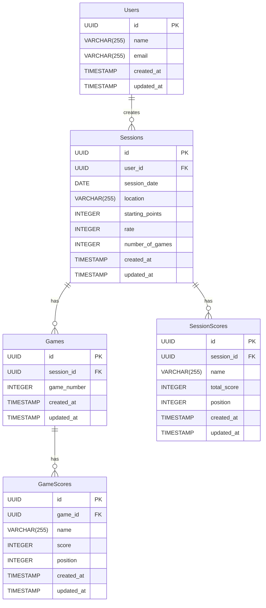

# 設計書

## 1. システム構成

### 1.1 アーキテクチャ概要
```
[Client]
  ├── Next.js (App Router)
  ├── React Components
  ├── TypeScript
  └── Tailwind CSS / shadcn/ui

[Backend]
  ├── Supabase (データストア)
  └── Clerk (認証)

[Infrastructure]
  └── Cloudflare
      ├── CDN
      └── Pages
```

## 2. データベース設計

### 2.1 ER図



### 2.2 テーブル定義

#### users テーブル
```sql
CREATE TABLE users (
  id UUID PRIMARY KEY DEFAULT uuid_generate_v4(),
  name VARCHAR(255) NOT NULL,
  email VARCHAR(255) NOT NULL UNIQUE,
  created_at TIMESTAMP WITH TIME ZONE DEFAULT CURRENT_TIMESTAMP,
  updated_at TIMESTAMP WITH TIME ZONE DEFAULT CURRENT_TIMESTAMP
);

CREATE INDEX idx_users_email ON users(email);
```

#### sessions テーブル
```sql
CREATE TABLE sessions (
  id UUID PRIMARY KEY DEFAULT uuid_generate_v4(),
  user_id UUID NOT NULL REFERENCES users(id) ON DELETE CASCADE,
  session_date DATE NOT NULL,
  location VARCHAR(255),
  starting_points INTEGER NOT NULL DEFAULT 25000,
  rate INTEGER NOT NULL DEFAULT 1,
  number_of_games INTEGER NOT NULL DEFAULT 0,
  created_at TIMESTAMP WITH TIME ZONE DEFAULT CURRENT_TIMESTAMP,
  updated_at TIMESTAMP WITH TIME ZONE DEFAULT CURRENT_TIMESTAMP,
  CONSTRAINT valid_starting_points CHECK (starting_points > 0),
  CONSTRAINT valid_rate CHECK (rate > 0),
  CONSTRAINT valid_number_of_games CHECK (number_of_games >= 0)
);

CREATE INDEX idx_sessions_date ON sessions(session_date);
CREATE INDEX idx_sessions_user_id ON sessions(user_id);
```

#### session_scores テーブル
```sql
CREATE TABLE session_scores (
  id UUID PRIMARY KEY DEFAULT uuid_generate_v4(),
  session_id UUID NOT NULL REFERENCES sessions(id) ON DELETE CASCADE,
  name VARCHAR(255) NOT NULL,
  total_score INTEGER NOT NULL DEFAULT 0,
  position INTEGER,
  created_at TIMESTAMP WITH TIME ZONE DEFAULT CURRENT_TIMESTAMP,
  updated_at TIMESTAMP WITH TIME ZONE DEFAULT CURRENT_TIMESTAMP,
  CONSTRAINT valid_position CHECK (position BETWEEN 1 AND 4),
  CONSTRAINT unique_session_name UNIQUE (session_id, name)
);

CREATE INDEX idx_session_scores_session_id ON session_scores(session_id);
```

#### games テーブル
```sql
CREATE TABLE games (
  id UUID PRIMARY KEY DEFAULT uuid_generate_v4(),
  session_id UUID NOT NULL REFERENCES sessions(id) ON DELETE CASCADE,
  game_number INTEGER NOT NULL,
  created_at TIMESTAMP WITH TIME ZONE DEFAULT CURRENT_TIMESTAMP,
  updated_at TIMESTAMP WITH TIME ZONE DEFAULT CURRENT_TIMESTAMP,
  CONSTRAINT valid_game_number CHECK (game_number > 0),
  CONSTRAINT unique_session_game_number UNIQUE (session_id, game_number)
);

CREATE INDEX idx_games_session_id ON games(session_id);
```

#### game_scores テーブル
```sql
CREATE TABLE game_scores (
  id UUID PRIMARY KEY DEFAULT uuid_generate_v4(),
  game_id UUID NOT NULL REFERENCES games(id) ON DELETE CASCADE,
  name VARCHAR(255) NOT NULL,
  score INTEGER NOT NULL,
  position INTEGER NOT NULL,
  created_at TIMESTAMP WITH TIME ZONE DEFAULT CURRENT_TIMESTAMP,
  updated_at TIMESTAMP WITH TIME ZONE DEFAULT CURRENT_TIMESTAMP,
  CONSTRAINT valid_position CHECK (position BETWEEN 1 AND 4),
  CONSTRAINT unique_game_name UNIQUE (game_id, name)
);

CREATE INDEX idx_game_scores_game_id ON game_scores(game_id);
```