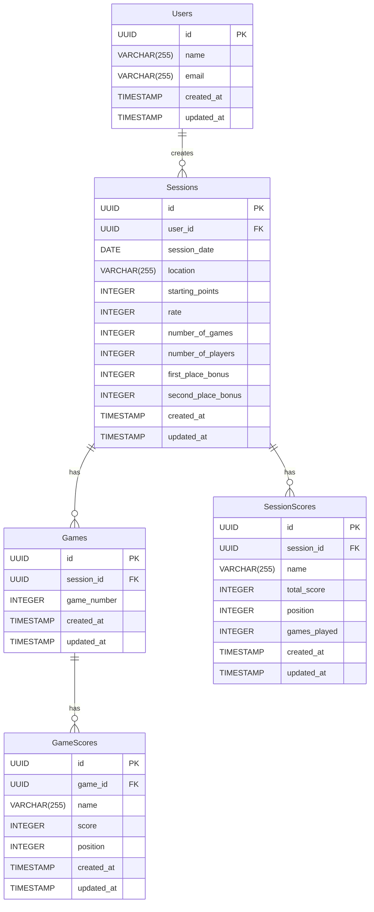

# 設計書

## 1. システム構成

### 1.1 アーキテクチャ概要

```
[Client]
  ├── Next.js (App Router)
  ├── React Components
  ├── TypeScript
  └── Tailwind CSS / shadcn/ui

[Backend]
  ├── Supabase (データストア)
  └── Clerk (認証)

[Infrastructure]
  └──Vercel
      ├── CDN
      └── Pages
```

## 2. データベース設計

### 2.1 ER図



### 2.2 テーブル定義

#### テーブル概要

##### users テーブル

アプリケーションのユーザー情報を管理するテーブルです。このテーブルには、アプリケーションにログインしてセッションを作成できるユーザーの情報のみが保存されます。Clerk認証と連携して使用します。

##### sessions テーブル

1日の麻雀対局セッションを管理するテーブルです。1レコードが1日の対局セッションを表し、開始点数やウマなどの基本設定、セッション全体の情報を保持します。同じ設定で複数半荘を行う場合にまとめて管理できます。3人戦や4人戦など、異なるプレイ人数に対応できます。

##### session_scores テーブル

セッションに参加した各プレイヤーの成績を管理するテーブルです。1レコードが1人のプレイヤーのセッション全体（その日の全ての半荘）での成績を表します。プレイヤーは名前で管理され、ユーザー登録は不要です。セッション参加者が4人以上の場合でも対応可能です。

##### games テーブル

各セッション内の半荘を管理するテーブルです。1レコードが1半荘（東1〜東4など一連の対局）を表します。セッション内での何回目の半荘かを game_number で管理します。

##### game_scores テーブル

1半荘での各プレイヤーの成績を管理するテーブルです。1レコードが1人のプレイヤーの1半荘での成績を表します。最終的な得点と順位を記録し、これを元にセッション全体の成績を計算します。

#### 各テーブルのカラム説明

##### users テーブル

| カラム名   | 型           | 説明                                   |
| ---------- | ------------ | -------------------------------------- |
| id         | UUID         | プライマリーキー。ユーザーの一意識別子 |
| name       | VARCHAR(255) | ユーザーの表示名                       |
| email      | VARCHAR(255) | ユーザーのメールアドレス。認証に使用   |
| created_at | TIMESTAMP    | レコード作成日時                       |
| updated_at | TIMESTAMP    | レコード更新日時                       |

##### sessions テーブル

| カラム名           | 型           | 説明                                            |
| ------------------ | ------------ | ----------------------------------------------- |
| id                 | UUID         | プライマリーキー。セッションの一意識別子        |
| user_id            | UUID         | セッションを作成したユーザーのID                |
| session_date       | DATE         | 対局日                                          |
| location           | VARCHAR(255) | 対局場所（任意）                                |
| starting_points    | INTEGER      | 開始点数（デフォルト25000）                     |
| rate               | INTEGER      | 点数レート。例：1の場合は1点=1円（デフォルト1） |
| number_of_games    | INTEGER      | セッション内の対局数                            |
| number_of_players  | INTEGER      | プレイ人数（3または4）                          |
| first_place_bonus  | INTEGER      | 1位のウマ（デフォルト30,000点）                 |
| second_place_bonus | INTEGER      | 2位のウマ（デフォルト10,000点）                 |
| created_at         | TIMESTAMP    | レコード作成日時                                |
| updated_at         | TIMESTAMP    | レコード更新日時                                |

##### session_scores テーブル

| カラム名     | 型           | 説明                                           |
| ------------ | ------------ | ---------------------------------------------- |
| id           | UUID         | プライマリーキー。セッションスコアの一意識別子 |
| session_id   | UUID         | 紐づくセッションのID                           |
| name         | VARCHAR(255) | プレイヤーの名前                               |
| total_score  | INTEGER      | セッション内での合計点数                       |
| position     | INTEGER      | 最終順位                                       |
| games_played | INTEGER      | 参加した対局数                                 |
| created_at   | TIMESTAMP    | レコード作成日時                               |
| updated_at   | TIMESTAMP    | レコード更新日時                               |

##### games テーブル

| カラム名    | 型        | 説明                                        |
| ----------- | --------- | ------------------------------------------- |
| id          | UUID      | プライマリーキー。対局の一意識別子          |
| session_id  | UUID      | 紐づくセッションのID                        |
| game_number | INTEGER   | セッション内での対局番号（1から始まる連番） |
| created_at  | TIMESTAMP | レコード作成日時                            |
| updated_at  | TIMESTAMP | レコード更新日時                            |

##### game_scores テーブル

| カラム名   | 型           | 説明                                     |
| ---------- | ------------ | ---------------------------------------- |
| id         | UUID         | プライマリーキー。対局スコアの一意識別子 |
| game_id    | UUID         | 紐づく対局のID                           |
| name       | VARCHAR(255) | プレイヤーの名前                         |
| score      | INTEGER      | 対局での得点                             |
| position   | INTEGER      | 対局での順位                             |
| created_at | TIMESTAMP    | レコード作成日時                         |
| updated_at | TIMESTAMP    | レコード更新日時                         |

#### users テーブル

```sql
CREATE TABLE users (
  id UUID PRIMARY KEY DEFAULT uuid_generate_v4(),
  name VARCHAR(255) NOT NULL,
  email VARCHAR(255) NOT NULL UNIQUE,
  created_at TIMESTAMP WITH TIME ZONE DEFAULT CURRENT_TIMESTAMP,
  updated_at TIMESTAMP WITH TIME ZONE DEFAULT CURRENT_TIMESTAMP
);

CREATE INDEX idx_users_email ON users(email);
```

#### sessions テーブル

```sql
CREATE TABLE sessions (
  id UUID PRIMARY KEY DEFAULT uuid_generate_v4(),
  user_id UUID NOT NULL REFERENCES users(id) ON DELETE CASCADE,
  session_date DATE NOT NULL,
  location VARCHAR(255),
  starting_points INTEGER NOT NULL DEFAULT 25000,
  rate INTEGER NOT NULL DEFAULT 1,
  number_of_games INTEGER NOT NULL DEFAULT 0,
  number_of_players INTEGER NOT NULL DEFAULT 4,
  first_place_bonus INTEGER NOT NULL DEFAULT 30000,
  second_place_bonus INTEGER NOT NULL DEFAULT 10000,
  created_at TIMESTAMP WITH TIME ZONE DEFAULT CURRENT_TIMESTAMP,
  updated_at TIMESTAMP WITH TIME ZONE DEFAULT CURRENT_TIMESTAMP,
  CONSTRAINT valid_starting_points CHECK (starting_points > 0),
  CONSTRAINT valid_rate CHECK (rate > 0),
  CONSTRAINT valid_number_of_games CHECK (number_of_games >= 0),
  CONSTRAINT valid_number_of_players CHECK (number_of_players IN (3, 4)),
  CONSTRAINT valid_first_place_bonus CHECK (first_place_bonus >= 0),
  CONSTRAINT valid_second_place_bonus CHECK (second_place_bonus >= 0)
);

CREATE INDEX idx_sessions_date ON sessions(session_date);
CREATE INDEX idx_sessions_user_id ON sessions(user_id);
```

#### session_scores テーブル

```sql
CREATE TABLE session_scores (
  id UUID PRIMARY KEY DEFAULT uuid_generate_v4(),
  session_id UUID NOT NULL REFERENCES sessions(id) ON DELETE CASCADE,
  name VARCHAR(255) NOT NULL,
  total_score INTEGER NOT NULL DEFAULT 0,
  position INTEGER,
  games_played INTEGER NOT NULL DEFAULT 0,
  created_at TIMESTAMP WITH TIME ZONE DEFAULT CURRENT_TIMESTAMP,
  updated_at TIMESTAMP WITH TIME ZONE DEFAULT CURRENT_TIMESTAMP,
  CONSTRAINT valid_position CHECK (position > 0),
  CONSTRAINT unique_session_name UNIQUE (session_id, name)
);

CREATE INDEX idx_session_scores_session_id ON session_scores(session_id);
```

#### games テーブル

```sql
CREATE TABLE games (
  id UUID PRIMARY KEY DEFAULT uuid_generate_v4(),
  session_id UUID NOT NULL REFERENCES sessions(id) ON DELETE CASCADE,
  game_number INTEGER NOT NULL,
  created_at TIMESTAMP WITH TIME ZONE DEFAULT CURRENT_TIMESTAMP,
  updated_at TIMESTAMP WITH TIME ZONE DEFAULT CURRENT_TIMESTAMP,
  CONSTRAINT valid_game_number CHECK (game_number > 0),
  CONSTRAINT unique_session_game_number UNIQUE (session_id, game_number)
);

CREATE INDEX idx_games_session_id ON games(session_id);
```

#### game_scores テーブル

```sql
CREATE TABLE game_scores (
  id UUID PRIMARY KEY DEFAULT uuid_generate_v4(),
  game_id UUID NOT NULL REFERENCES games(id) ON DELETE CASCADE,
  name VARCHAR(255) NOT NULL,
  score INTEGER NOT NULL,
  position INTEGER NOT NULL,
  created_at TIMESTAMP WITH TIME ZONE DEFAULT CURRENT_TIMESTAMP,
  updated_at TIMESTAMP WITH TIME ZONE DEFAULT CURRENT_TIMESTAMP,
  CONSTRAINT valid_position CHECK (position > 0),
  CONSTRAINT unique_game_name UNIQUE (game_id, name)
);

CREATE INDEX idx_game_scores_game_id ON game_scores(game_id);
```
